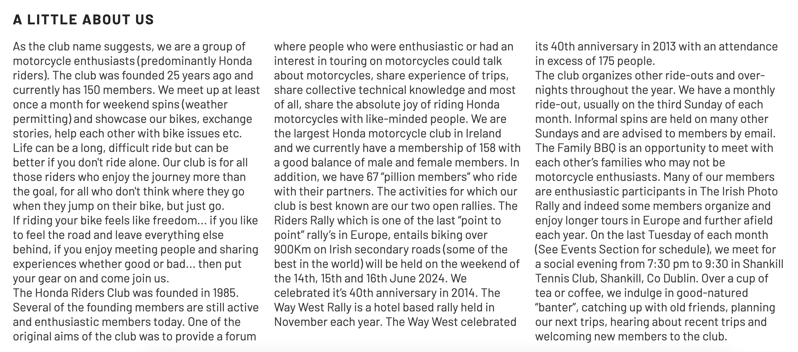
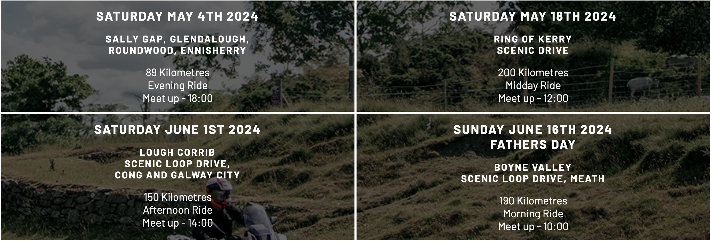

# Honda Riders Club

Honda Riders Club is a site to help like-minded people connect. It gives Honda riders throughout Ireland the opportunity to meet other Honda riders, share stories and experiences, and help eachother with maintainance issues.

Honda Riders Club will be useful for members to see and plan for upcoming events.

## Features

The site is fully responsive and can be viewed on desktop, laptop, tablet/iPad, or mobile phone.

- __Navigation Bar__

  - Featured on all pages, the fully responsive nav bar includes links to the Logo, Home page, Gallery, Event page and Join Us page and is identical on each page to allow for easy navigation.
  - This allows the user to easily navigate from page to page, across all devices, without having to revert back to the previous page via the ‘back’ button. 
  - The current page is easily identified on the Navigation Bar as it appears as capitalised, bold font with 1px rule above and below.

- __The Home Page image__

  - The home page opens with a photograph of motorcycles on a country road, quickly giving the feel of the site to the user. 
  - This page introduces the user to the club and the eye catching photo pulls the user towards the open road.

- __About Us Section__

  - The About Us section gives the user an outline of the club, the members, and the activities that take place as a member. 
  - The user will see the value of becoming a member and should be encouraged to join up. 

- __The Footer__ 

  - The footer section includes links to the relevant social media sites for Honda Riders Club. The links will open to a new tab to allow easy navigation for the user. 
  - The footer is valuable to the user as it encourages them to keep connected via social media.

- __Gallery Page__

  - The gallery page provides the user with member images and gives an insight into the bikes that current members ride. 
  - This section is valuable to the user as it shows the human aspect of the club, showing people on bikes. 

- __Events Page__

  - This page allows the user to see exactly when meetups and rides are scheduled, where they will be located, how long the ride will be in kilometers and the time of day that the rides is scheduled. 
  - This section will be updated as events change to keep the user up to date. 

- __The Join Us Page__

  - This page allows the user to join the club and subscribe to the newsletter. The user will be able specify if they want to receive a weekly or monthly newsletter, or choose None if they prefer not to receive. The user will be asked to submit their full name and email address (mandatory) and a nick name (optional) if they prefer to be called something different. 

## Testing 

The site was tested for usability and navigation in Chrome, Firefox, Brave and Safari. The site was tested for responsiveness in all four browsers but more specifically in Chrome, using Developer Tools where it resulted in each page behaving as it should when screen sizes were changed.
The site was then run through Lighthouse with particular focus on Accessibility where it scored 100%.

### Validator Testing 

- HTML
  - No errors were returned when passing through the official [W3C validator](https://validator.w3.org/nu/?doc=https%3A%2F%2Fcode-institute-org.github.io%2Flove-running-2.0%2Findex.html)
- CSS
  - No errors were found when passing through the official [(Jigsaw) validator](https://jigsaw.w3.org/css-validator/validator?uri=https%3A%2F%2Fvalidator.w3.org%2Fnu%2F%3Fdoc%3Dhttps%253A%252F%252Fcode-institute-org.github.io%252Flove-running-2.0%252Findex.html&profile=css3svg&usermedium=all&warning=1&vextwarning=&lang=en#css)

## Deployment

- The site was deployed to GitHub pages. The steps to deploy are as follows: 
  - In the GitHub repository, navigate to the Settings tab 
  - From the source section drop-down menu, select the Master Branch
  - Once the master branch has been selected, the page will be automatically refreshed with a detailed ribbon display to indicate the successful deployment. 

The live link can be found here - https://chrisf64.github.io/Honda-Riders-Club/index.html 

## Credits 

In this section you need to reference where you got your content, media and extra help from. It is common practice to use code from other repositories and tutorials, however, it is important to be very specific about these sources to avoid plagiarism. 

You can break the credits section up into Content and Media, depending on what you have included in your project. 

### Content 

- The text for the Home page was taken from Wikipedia Article A
- Instructions on how to implement form validation on the Sign Up page was taken from [Specific YouTube Tutorial](https://www.youtube.com/)
- The icons in the footer were taken from [Font Awesome](https://fontawesome.com/)

### Media

- The photos used on the home and sign up page are from This Open Source site
- The images used for the gallery page were taken from this other open source site

