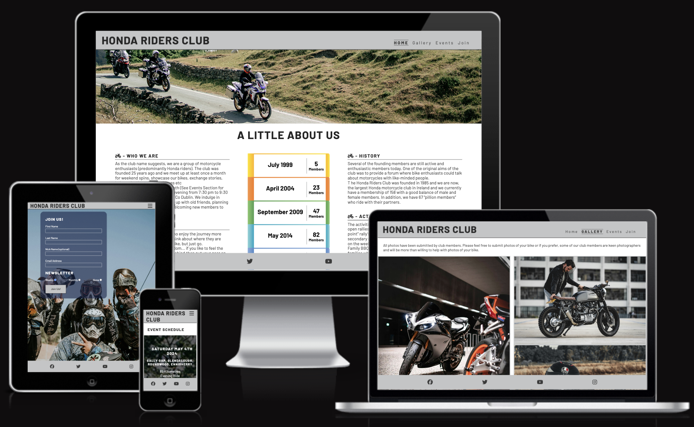
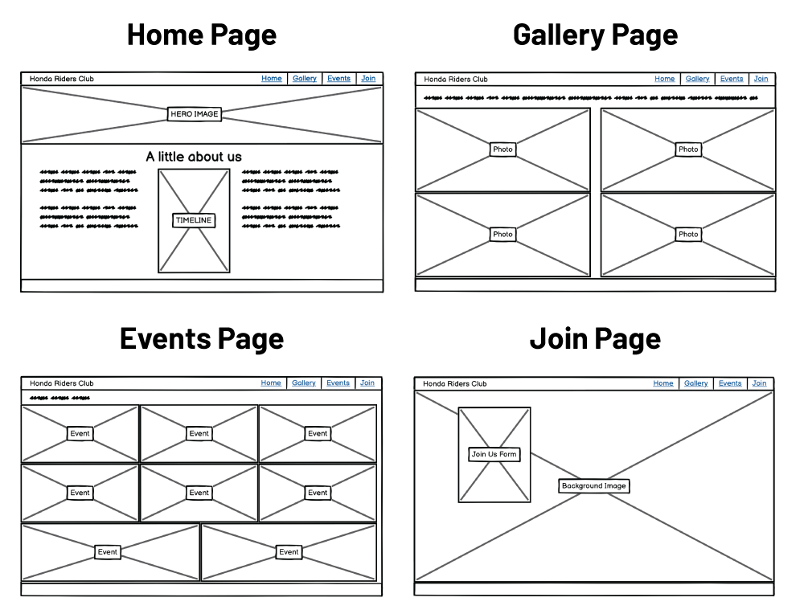
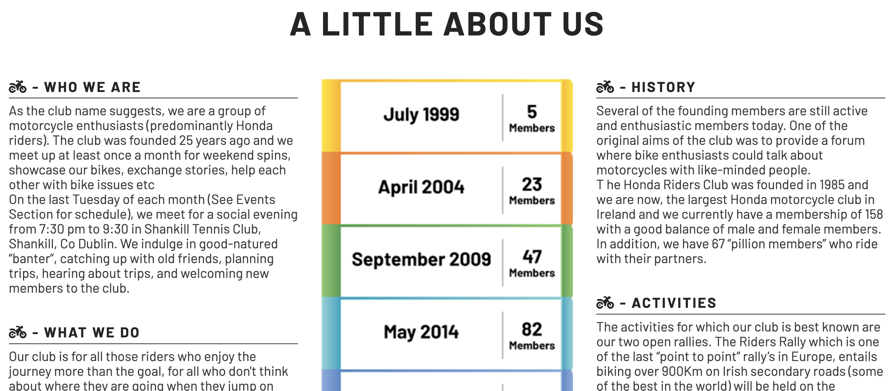
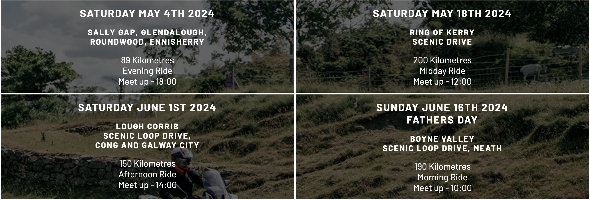
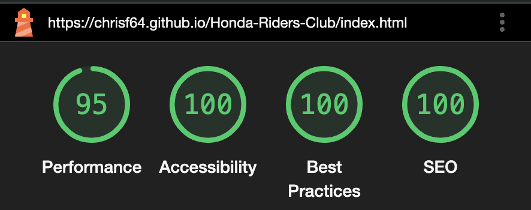
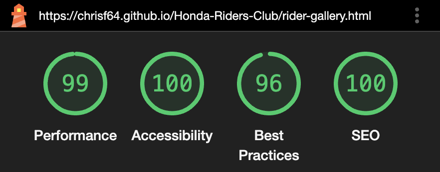
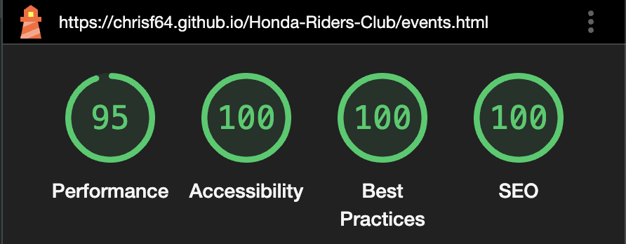
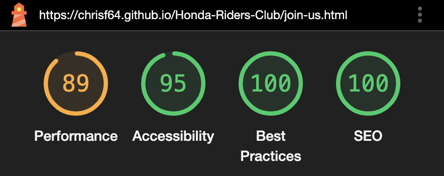

# Honda Bikers Club

[View the live project here](https://chrisf64.github.io/Honda-Riders-Club/index.html)

## Table of Contents
1.  [Introduction](#Introduction)
2.  [UX](#UX)
    1.  [Ideal Users](#ideal-users)
    2.  [User Stories](#user-stories)  
    3.  [Development Planes](#Development-Planes)

## Introduction
This website was made to provide information regarding a fictional motorcycle club based out of Dublin, Ireland. The target audience is the bike community of Ireland. 

This website was made for the first of five Milestone projects required to complete the Diploma in Software development program at The Code Institute. 

The main requirements of this project are to build a responsive and static front-end site to present useful information to users using all the technologies learned so far, namely HTML5 and CSS3. The site is to contain no less than three pages.

## UX
### Ideal Users
The ideal user for this website is:
* Experienced rider
* New rider

### User-Stories
#### Experienced Rider Goals
1. As an experienced rider, I want to see regular updates to the events page.
2. As an experienced rider, I want to easily navigate through the site and access the information I require with ease.
3. As an experienced rider, I want to easily navigate to content I have previously viewed within a small number of steps.

#### New Rider Goals
1. As a new rider, I want to easily navigate the entire site intuitively. 
2. As a new rider, I want the information I seek to be easily accessible and relevant.

### Development-Planes
To create a website that answers the above user stories and identifies the functionality of the site. This includes an introduction, an events page, current member photos and a join us page.

#### Strategy
Strategy incorporates user needs as well as product objectives. This website will focus on the following target audience, divided into three main categories:
- **Roles:**
    - Experienced riders
    - New riders

- **Demographic:**
    - All ages
    - Irish Honda riders or Honda riders residing in Ireland
    - Beginner to experienced Honda riders

The website needs to enable the **rider** to:
- Retrieve the desired information:
    - How to join the club
    - Upcoming events
    - Photos from past events and of current members bikes 
    
The website needs to enable the **site manager** to:
- Update events page as necessary
- Update gallery page with new photos as they become available
- Receive new member applications from the join us page

#### Scope
Using the information from the strategy plane, the identified required features have been broken into the following two categories.
- Content Requirements:
    - The user will be looking for:
        - Information on upcoming events
        - New photos from current members and events
        - New users will require the ability to join the club
- Functionality Requirements:
    - The user will be able to:
        - Easily navigate the site to find the information they require
        - Apply to join the club and receive weekly/monthly newsletters

#### Structure
The information above was then organized in a hierarchical tree structure, a site map, showing how users can navigate through the site with ease and efficiency, with the following results:

#### Skeleton
Wireframes were made to showcase the appearance of the site pages while keeping a positive user experience in mind. The wireframes were created using a desktop version of [Balsamiq](https://balsamiq.com/).

## Features
### Design Features
Each page within the site has a consistent and responsive navigation system. The details of features on the site are detailed below.
- The **Header** is across the top of the page and appears on each page for brand recognition.
- The **Navigation Bar** appears within the header on all pages and is easy. 

- On smaller screen sizes, the **Navigation Bar** collapses into a **Hamburger Menu** that, when clicked or tapped, opens a sidebar below the logo which shows the navigation options.
- The **Footer** is 100% in width and stays at the bottom of the screen at all times, on all screen sizes. Each social media link opens in a new tab. 

- The **Home** page contains a Hero image 
 
- The **Home** page also contains an About section, giving an overview of the club 

- The **Gallery** page contains photos of bike and events, all supplied by members 

- The **Events** page allows the user to browse through scheduled events 

- The **Join** page contains a form to allow the user to join the club, choose to subscribe to the newsletter either weekly, monthly, or not at all 

### Existing Features
- **Social Media Icons** - Appearing on every page in the footer, the icons are appropriate representations of the Social Media platforms.

## Issues and Bugs 
The developer ran into several issues during the development of the website, with the noteworthy ones listed below:
- Header and Nav bar became unresponsive while formatting index page, this was due to code being moved and was easily discovered and corrected using dev tools in Chrome.
- Stray end tag was found when validating HTML code in [W3C validator](https://validator.w3.org/nu/?doc=https%3A%2F%2Fcode-institute-org.github.io%2Flove-running-2.0%2Findex.html)
- Similarly, a stray curly bracket generated an error when validating CSS stylesheet in [(Jigsaw) validator](https://jigsaw.w3.org/css-validator/validator?uri=https%3A%2F%2Fvalidator.w3.org%2Fnu%2F%3Fdoc%3Dhttps%253A%252F%252Fcode-institute-org.github.io%252Flove-running-2.0%252Findex.html&profile=css3svg&usermedium=all&warning=1&vextwarning=&lang=en#css)

## Technologies Used
### Languages Used
- [HTML5](https://en.wikipedia.org/wiki/HTML5 "Link to HTML Wiki")
- [CSS3](https://en.wikipedia.org/wiki/Cascading_Style_Sheets "Link to CSS Wiki")

### Frameworks, Libraries & Programs Used
- [Google Fonts](https://fonts.google.com/ "Link to Google Fonts")
    - Google fonts was used to import the fonts "Special Elite", "Open Sans", "Oswald" and "Nosifer" into the style.css file. These fonts were used throughout the project.
- [Font Awesome](https://fontawesome.com/ "Link to FontAwesome")
     - Font Awesome was used on almost all pages throughout the website to import icons (e.g. social media icons) for UX purposes.
- [GitPod](https://gitpod.io/ "Link to GitPod homepage")
     - GitPod was used for writing code, commiting, and then pushing to GitHub.
- [GitHub](https://github.com/ "Link to GitHub")
     - GitHub was used to store the project after pushing
- [Balsamiq](https://balsamiq.com/ "Link to Balsamiq homepage")
     - Balsamiq was used to create the wireframes during the design phase of the project.
- [Am I Responsive?](http://ami.responsivedesign.is/# "Link to Am I Responsive Homepage")
     - Am I Responsive was used in order to see responsive design throughout the process and to generate mockup imagery to be used.
    
## Testing 
The site was tested for usability and navigation in Chrome, Firefox, Brave and Safari. The site was tested for responsiveness in all four browsers but more specifically in Chrome, using Developer Tools where it resulted in each page behaving as it should when screen sizes were changed.
The site was then run through Lighthouse with particular focus on Accessibility where it scored 100% on almost all pages:
- Index page  

- Gallery page 

- Events page 

- Join page 

### Validator Testing 
- HTML
  - No errors were returned when passing through the official [W3C validator](https://validator.w3.org/nu/?doc=https%3A%2F%2Fcode-institute-org.github.io%2Flove-running-2.0%2Findex.html)

- CSS
  - One error was initially found when passing through the official [(Jigsaw) validator](https://jigsaw.w3.org/css-validator/validator?uri=https%3A%2F%2Fvalidator.w3.org%2Fnu%2F%3Fdoc%3Dhttps%253A%252F%252Fcode-institute-org.github.io%252Flove-running-2.0%252Findex.html&profile=css3svg&usermedium=all&warning=1&vextwarning=&lang=en#css)
  The error was triggered by a stray curly bracket and was tidied up.

## Deployment
This project was developed using [GitPod](https://www.gitpod.io/ "Link to GitPod site"), which was then committed and pushed to GitHub using the GitPod terminal.

### Deploying on GitHub Pages
To deploy this page to GitHub Pages from its GitHub repository, the following steps were taken:

1. Log into [GitHub](https://github.com/login "Link to GitHub login page") or [create an account](https://github.com/join "Link to GitHub create account page").
2. Locate the [GitHub Repository](https://github.com/Irishbecky91/survival-guild "Link to GitHub Repo").
3. At the top of the repository, select Settings from the menu items.
4. Scroll down the Settings page to the "Pages" section.
5. Under "Source" click the drop-down menu labelled "None" and select "Main".
6. Upon selection, the page will automatically refresh meaning that the website is now deployed.
7. Scroll back down to the "Pages" section to retrieve the deployed link.

## Credits 

### Media
- All images (apart from Timeline image - generated by developer) were sourced from the various artists from [Pexels](https://www.pexels.com/ "Link to Pexels").

### Code 
The developer consulted multiple sites in order to better understand the code they were trying to implement. The develope liked the airy feel of the Love Running website project and opted to create a similar site for Honda Riders Club. The developer used and modified some of the code from Love Running project.he following site was used on a more regular basis:
- [W3Schools](https://www.w3schools.com/ "Link to W3Schools page")

## Acknowledgements
- I want to thank my mentor Koko, for her invaluable help and guidance.