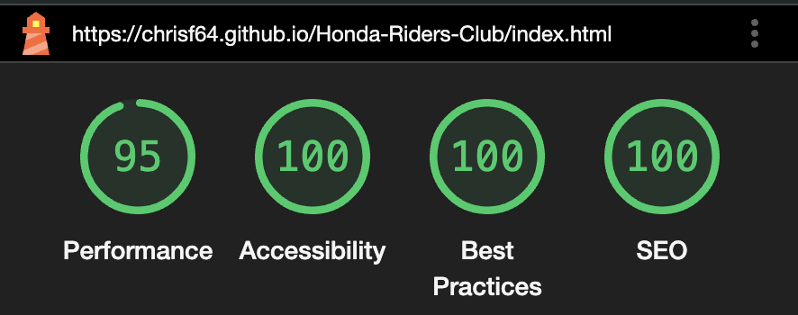
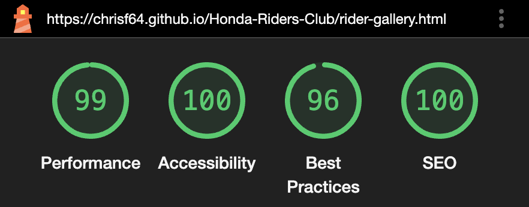
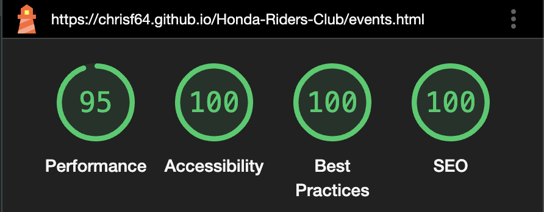
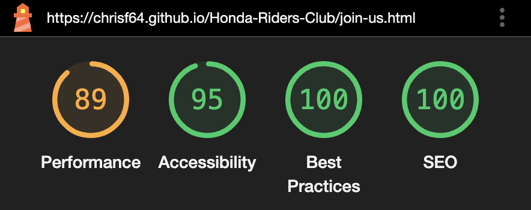

# Honda Bikers Club

[View the live project here](https://chrisf64.github.io/Honda-Riders-Club/index.html)

#### Skeleton
Wireframes were made to showcase the appearance of the site pages while keeping a positive user experience in mind. The wireframes were created using a desktop version of [Balsamiq](https://balsamiq.com/).

## Features
### Design Features
Each page within the site has a consistent and responsive navigation system. The details of features on the site are detailed below.
- The **Header** is across the top of the page and appears on each page for brand recognition.
- The **Navigation Bar** appears within the header on all pages and is easy. It is then replaced by a hamburger menu.
- The **Navigation Bar** collapses into a **Hamburger Menu** that, when clicked or tapped, opens a sidebar below the logo which shows the navigation options.
- The **Footer** is 100% in width and stays at the bottom of the screen at all times, on all screen sizes. Each social media link opens in a new tab.

### Existing Features
- **Social Media Icons** - Appearing on every page in the footer, the icons are appropriate representations of the Social Media platforms.

### Features to Implement in the future
- **Helpful Links Page**
     - **Feature** - create a page with links to external sites where users can purchase the items discussed on the various pages.
     - **Reason for not featuring in this release** - Not enough time to create this page before the submission date.

## Issues and Bugs 
The developer ran into several issues during the development of the website, with the noteworthy ones listed below, along with solutions or ideas to implement in the future.

**Background Bug** - A bug was detected early in development in the background of the main pages. While entering content onto the home page, the background colours were not covering the entire page, cutting off short and leaving a white background behind some of the content. The developer put a query to the #css-essentials channel in Slack and was provided with a simple piece of code from another user of Slack (Anthony O'Brien) which resolved the issue. It was from here that the developer was able to copy the code given as a solution to the bug, with celebratory success. This same issue occurred later on other pages, which the same piece of code was able to rectify.

Background Bug

    

    

**Navigation Bar/Hamburger Menu Responsiveness Bug** - A bug was detected while introducing responsiveness to the navigation bar and hamburger menu. At 1200px exactly, both the navigation bar and hamburger menus vanished. It was found that this was caused by setting the hamburger menu to be hidden at 1200px and up, and the navigation bar to be hidden at 1200px and down. The issue was rectified simply by changing the hamburger menu to be hidden from 1201px and up instead.

**Google Maps Embedding Bug** - A bug was detected when embedding the Google map to be used for the Contact Page. The developer was previously using the web address to embed the map into the contact page. This caused an error that prevented the map from loading. The developer found that the link was to be embedded using the pre-existing embedding code provided by Google Maps, which was previously unknown to the developer. Upon implementing the correct embedding code, the map worked perfectly.

**Back-to-top Button Bug** - A bug was detected in the Back-to-top Button where the Awesome Fonts arrow up icon disappeared. It was found that the developer was using the wrong class to colour the icon, causing it to appear invisible. This was rectified by introducing a new class name of "top-home", to which the colouring was applied. In addition to this, during the validation of the code, an error appeared in the code for the button. It appears that the code borrowed from <a href="https://secluded.site/adding-a-better-scroll-to-top-button-without-javascript/">Secluded.Site</a> was causing the problem. While the code worked perfectly, the creator placed a <button> element as a descendant of the <a> element, causing the error.

**Double-click Ads Link Bug** - A bug was detected in the developer tools console. On the survival-tips.html and camp-setup.html pages, a bug appeared saying "Loading failed for the <script> with source 'http://static.doubleclick.net/instream/as-status.js'". After careful testing, the source of the bug was found to be the YouTube videos embedded in the page, which the developer was unable to alter to remove the bug. 

## Technologies Used
### Main Languages Used
- [HTML5](https://en.wikipedia.org/wiki/HTML5 "Link to HTML Wiki")
- [CSS3](https://en.wikipedia.org/wiki/Cascading_Style_Sheets "Link to CSS Wiki")

### Frameworks, Libraries & Programs Used
- [Google Fonts](https://fonts.google.com/ "Link to Google Fonts")
    - Google fonts was used to import the fonts "Special Elite", "Open Sans", "Oswald" and "Nosifer" into the style.css file. These fonts were used throughout the project.
- [Font Awesome](https://fontawesome.com/ "Link to FontAwesome")
     - Font Awesome was used on almost all pages throughout the website to import icons (e.g. social media icons) for UX purposes.
- [GitPod](https://gitpod.io/ "Link to GitPod homepage")
     - GitPod was used for writing code, commiting, and then pushing to GitHub.
- [GitHub](https://github.com/ "Link to GitHub")
     - GitHub was used to store the project after pushing
- [Balsamiq](https://balsamiq.com/ "Link to Balsamiq homepage")
     - Balsamiq was used to create the wireframes during the design phase of the project.
- [Am I Responsive?](http://ami.responsivedesign.is/# "Link to Am I Responsive Homepage")
     - Am I Responsive was used in order to see responsive design throughout the process and to generate mockup imagery to be used.
    
## Testing 
The site was tested for usability and navigation in Chrome, Firefox, Brave and Safari. The site was tested for responsiveness in all four browsers but more specifically in Chrome, using Developer Tools where it resulted in each page behaving as it should when screen sizes were changed.
The site was then run through Lighthouse with particular focus on Accessibility where it scored 100% on almost all pages:
- Index page

- Gallery page

- Events page

- Join page

### Validator Testing 

- HTML
  - No errors were returned when passing through the official [W3C validator](https://validator.w3.org/nu/?doc=https%3A%2F%2Fcode-institute-org.github.io%2Flove-running-2.0%2Findex.html)

- CSS
  - One error was initially found when passing through the official [(Jigsaw) validator](https://jigsaw.w3.org/css-validator/validator?uri=https%3A%2F%2Fvalidator.w3.org%2Fnu%2F%3Fdoc%3Dhttps%253A%252F%252Fcode-institute-org.github.io%252Flove-running-2.0%252Findex.html&profile=css3svg&usermedium=all&warning=1&vextwarning=&lang=en#css)
  The error was triggered by a stray curly bracket and was tidied up.

## Deployment

This project was developed using [GitPod](https://www.gitpod.io/ "Link to GitPod site"), which was then committed and pushed to GitHub using the GitPod terminal.

### Deploying on GitHub Pages
To deploy this page to GitHub Pages from its GitHub repository, the following steps were taken:

1. Log into [GitHub](https://github.com/login "Link to GitHub login page") or [create an account](https://github.com/join "Link to GitHub create account page").
2. Locate the [GitHub Repository](https://github.com/Irishbecky91/survival-guild "Link to GitHub Repo").
3. At the top of the repository, select Settings from the menu items.
4. Scroll down the Settings page to the "Pages" section.
5. Under "Source" click the drop-down menu labelled "None" and select "Main".
6. Upon selection, the page will automatically refresh meaning that the website is now deployed.
7. Scroll back down to the "Pages" section to retrieve the deployed link.
    

    
## Credits 

### Content
- Some of the text used in the the various pages were borrowed and adapted from various sites, listed below.
    - [Reserve America](https://www.reserveamerica.com/outdoors/how-to-start-a-campfire.html "Link to Reserve America - How to Start a Campfire")
    - [Seeker](https://www.seeker.com/top-ways-to-purify-water-in-the-wilderness-1765491027.htmlhttps://www.seeker.com/top-ways-to-purify-water-in-the-wilderness-1765491027.html "Link to Seeker - Purifying Water")
    - [Survival Freedom]( https://survivalfreedom.com/10-ways-to-build-a-shelter-out-of-natural-resources/ "Link to Survival Freedom - Building Shelter from Natural Resources")

### Media
- Almost all images were sourced from the various artists from [Unsplash](https://unsplash.com/ "Link to Unsplash") and [Pixabay](https://pixabay.com/ "Link to Pixabay").
- The images of "The infected" were sourced from [Soufiane Idrassi](https://www.artstation.com/cgsoufiane "Link to Soufiane Idrassi's account on Art Station") through the website [Art Station](https://www.artstation.com/ "Link to Art Station Home Page").
- All videos were sourced from various channels on [YouTube](https://youtube.com/ "Link to YouTube Home Page")

### Code 
The developer consulted multiple sites in order to better understand the code they were trying to implement. For code that was copied and edited, the developer made sure to reference this with the code. The following sites were used on a more regular basis:
- [Stack Overflow](https://stackoverflow.com/ "Link to Stack Overflow page")
- [W3Schools](https://www.w3schools.com/ "Link to W3Schools page")

## Acknowledgements

- I would like to thank my my mentor, Koko, for her invaluable help and guidance throughout the process.