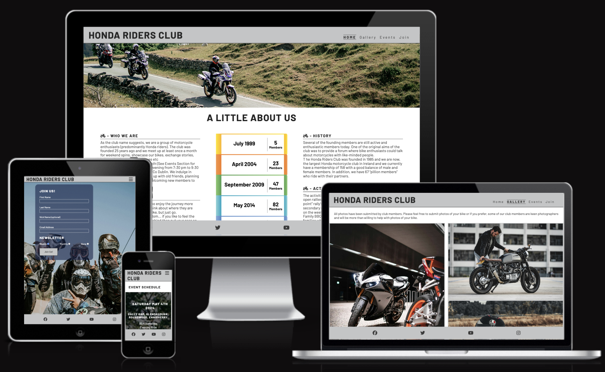
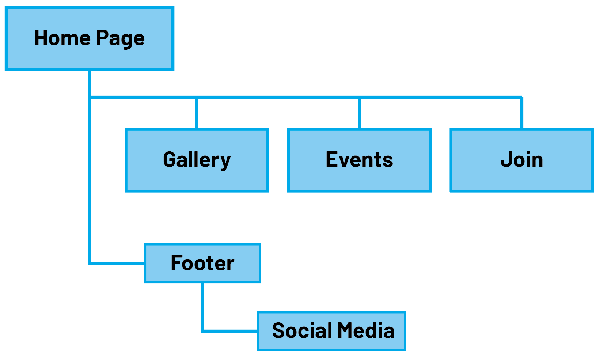

# Honda Bikers Club

[View the live project here](https://chrisf64.github.io/Honda-Riders-Club/index.html)

## Introduction
This website was made to provide information regarding a fictional motorcycle club based out of Dublin, Ireland. The target audience is the bike community of Ireland. 

This website was made for the first of five Milestone projects required to complete the Diploma in Software development program at The Code Institute. 

The main requirements of this project are to build a responsive and static front-end site to present useful information to users using all the technologies learned so far, namely HTML5 and CSS3. The site is to contain no less than three pages.

## UX
### Ideal Users
The ideal user for this website is:
* Current user
* New user
* Experienced rider
* New rider

### User-Stories
#### Current User Goals
1. As a current user, I want to see regular updates to the events page.
2. As a current user, I want to easily navigate through the site and access the information I require with ease.
3. As a current user, I want to easily navigate to content I have previously viewed within a small number of steps.

#### New User Goals
1. As a new user, I want to easily navigate the entire site intuitively. 
2. As a new user, I want the information I seek to be easily accessible and relevant.

### Development-Planes
To create a website that answers the above user stories and identifies the functionality of the site. This includes an introduction, an events page, current member photos and a join us page.

#### Strategy
Strategy incorporates user needs as well as product objectives. This website will focus on the following target audience, divided into three main categories:
- **Roles:**
    - Current users
    - New users
    - Experienced riders
    - New riders

- **Demographic:**
    - All ages
    - Irish Honda riders or Honda riders residing in Ireland
    - Beginner to experienced Honda riders

The website needs to enable the **user** to:
- Retrieve the desired information:
    - How to join the club
    - Upcoming events
    - Photos from past events and of current members bikes 
    
The website needs to enable the **site manager** to:
- Update events page as necessary
- Update gallery page with new photos as they become available
- Receive new member applications from the join us page

#### Scope
Using the information from the strategy plane, the identified required features have been broken into the following two categories.
- Content Requirements:
    - The user will be looking for:
        - Information on upcoming events
        - New photos from current members and events
        - New users will require the ability to join the club
- Functionality Requirements:
    - The user will be able to:
        - Easily navigate the site to find the information they require
        - Apply to join the club and receive weekly/monthly newsletters

#### Structure
The information above was then organized in a hierarchical tree structure, a site map, showing how users can navigate through the site with ease and efficiency, with the following results:

